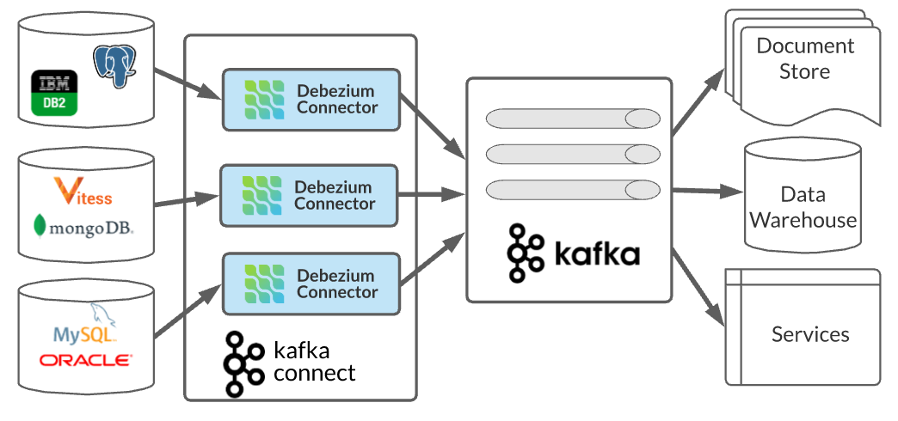

# Spring Boot Debezium MongoDB and MySQL CDC

This repository provides a Spring Boot application that demonstrates Change Data Capture (CDC) using Debezium with MongoDB and MySQL databases. It showcases how to capture and process real-time database changes using Debezium connectors in a Spring Boot application.

## Prerequisites

Before running the application, ensure you have the following software installed:

- Java Development Kit (JDK) 11 or higher
- Apache Maven
- Docker and Docker Compose

## Setup

1. Clone the repository
2. Navigate to the project directory
3. create custom mongo docker
```shell
docker build -t  mongoex:1.0 .
```
4.Start the MongoDB and MySQL containers using Docker Compose:
 ```shell
 docker-compose up -d
 ```
5.Run the application
6.Run connectors command
```shell
sh connectionCommand.sh
```
change data manually and get event in UserConsumer class

